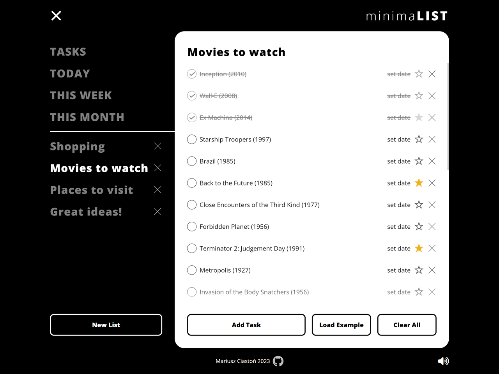

# minimaLIST

Minimalistic black and white Todo list app with cute sounds

Features: 
• Adding new lists 
• Removing lists 
• Changing list name 
• Adding new tasks 
• Removing tasks 
• Changing task name 
• Toggling task done status 
• Setting and changing task date 
• Toggling task priority (star) 
• Notification when list or task name in input field is empty or already exists 
• 'Load Example' button loads example lists and tasks 
• 'Clear All' button removes all user created lists and tasks 
• 'TODAY', 'THIS WEEK', 'THIS MONTH' lists filter tasks by date (using date-fns library) and sort them from the earliest 
• UI is responsive and width of tasks area can be altered using hamburger menu icon 
• Keyboard support on adding and changing lists and tasks (Enter, Escape...) 
• Sounds when interacting with UI 
• Speaker icon can be used to mute sounds 
• Local Storage is used to remember all lists, tasks (with it's properties), active list and mute status

Known problems: 
• Firefox doesn't support :has pseudo-class as of october 2023 so there are some interface glitches. I could use some javascript to solve that but don't want to. Hopefully Firefox catches up soon.

[Live Demo](https://mariuszciaston.github.io/minimaLIST/) :point_left:   

